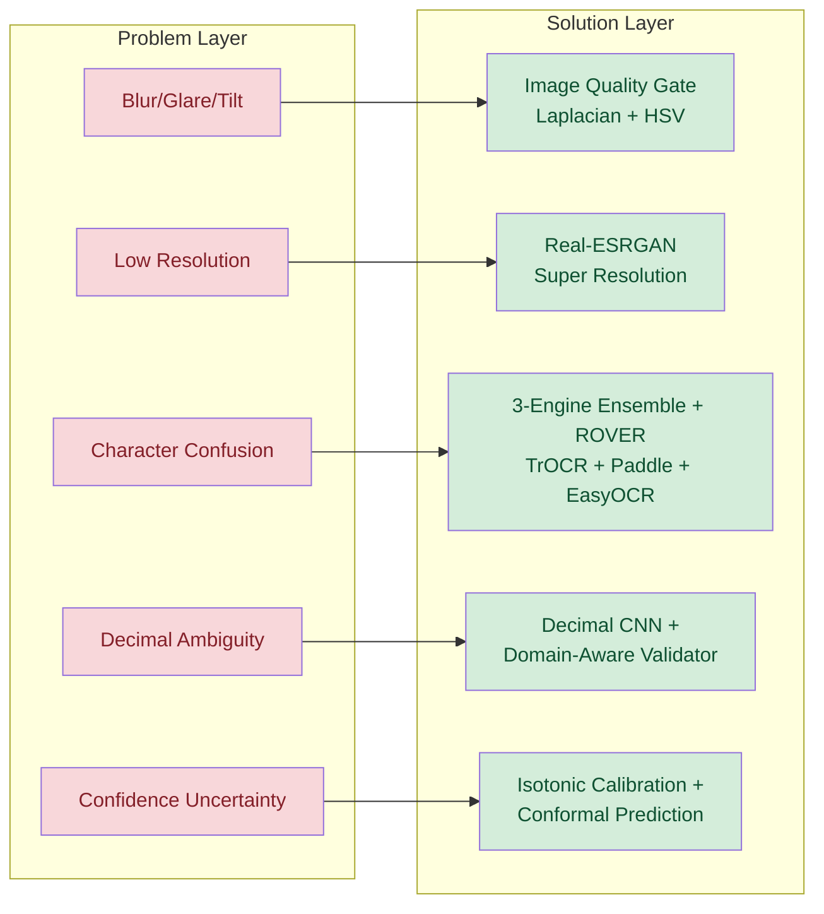
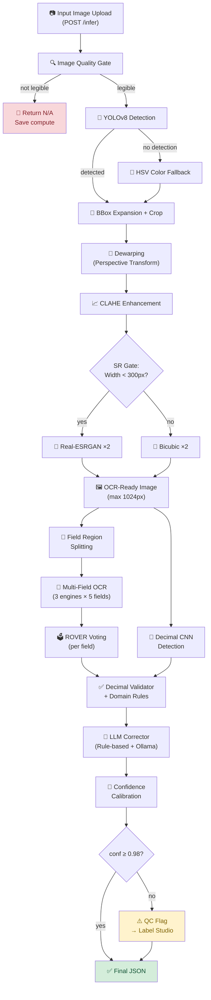
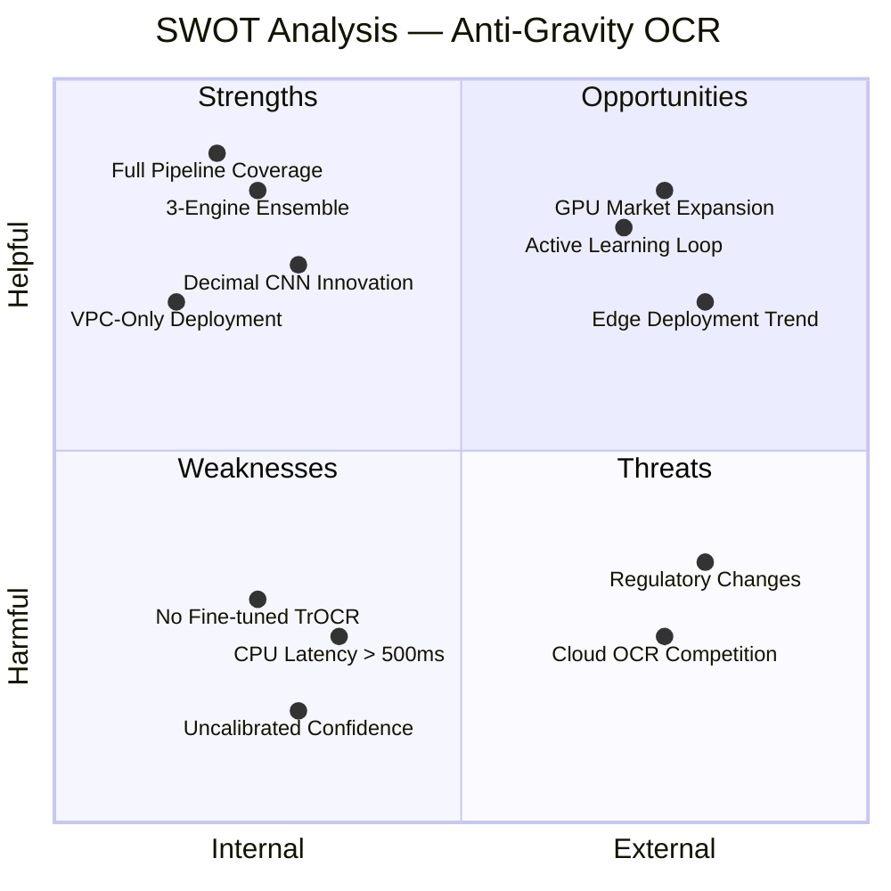
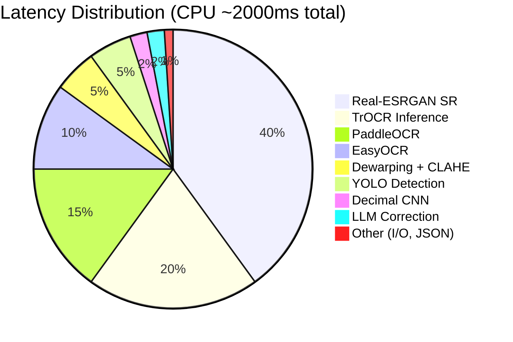
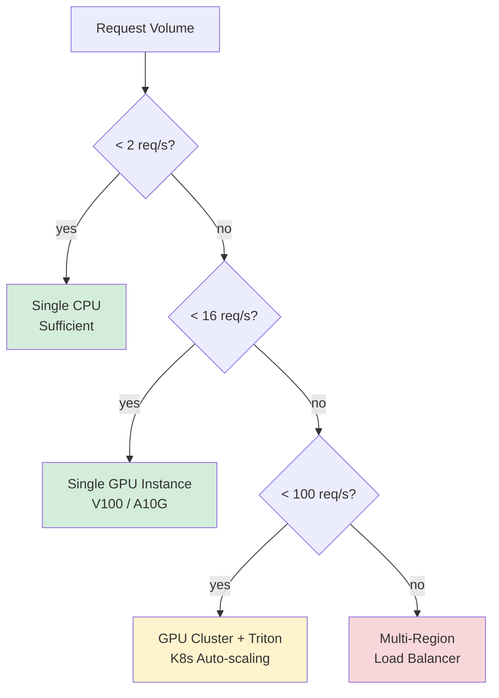
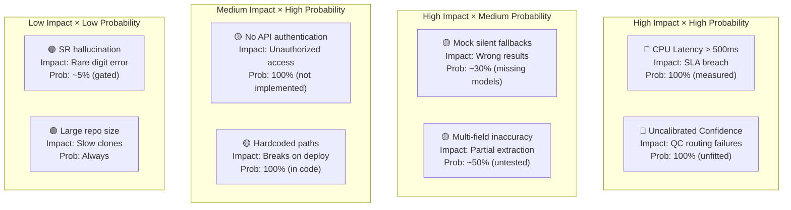

# 📋 Instinct GPT OCR — Problem Statement: End-to-End Analysis Report

**Project:** Anti-Gravity OCR Pipeline  
**Version:** 2.0.0  
**Report Date:** 2026-03-15  
**Repository:** [praveen0767/Insitinct_GPT_OCr](https://github.com/praveen0767/Insitinct_GPT_OCr)

---

## Table of Contents

1. [Problem Statement](#1-problem-statement)
2. [Solution Overview](#2-solution-overview)
3. [End-to-End Architecture Analysis](#3-end-to-end-architecture-analysis)
4. [SWOT Analysis](#4-swot-analysis)
5. [Pros — Detailed Breakdown](#5-pros--detailed-breakdown)
6. [Cons — Detailed Breakdown](#6-cons--detailed-breakdown)
7. [Module-Level Risk Assessment](#7-module-level-risk-assessment)
8. [Performance Analysis](#8-performance-analysis)
9. [Security & Compliance Analysis](#9-security--compliance-analysis)
10. [Scalability Assessment](#10-scalability-assessment)
11. [Cost Analysis](#11-cost-analysis)
12. [Competitive Landscape](#12-competitive-landscape)
13. [Test Coverage & Quality](#13-test-coverage--quality)
14. [Gap Analysis — Current vs Target](#14-gap-analysis--current-vs-target)
15. [Risk Matrix](#15-risk-matrix)
16. [Recommendations & Roadmap](#16-recommendations--roadmap)
17. [Conclusion](#17-conclusion)

---

## 1. Problem Statement

### 1.1 The Challenge

Utility companies across India and other markets deploy millions of electromechanical and digital meters. Field agents capture photographs of meter displays to record monthly consumption readings. This process is plagued by:

| Problem | Impact |
|---|---|
| **Image variability** | Motion blur, glare, tilt, low resolution, poor lighting |
| **Manual transcription errors** | Human error rate of 3–7% in manual reading entry |
| **High QC cost** | Dedicated teams re-verify millions of readings every billing cycle |
| **Scale** | Millions of meters × 12 monthly reads/year = billions of image-to-text conversions |
| **Multi-field extraction** | Each meter has 4–5 numerical fields (kWh, kVAh, MD kW, Demand kVA, Serial Number) |
| **Decimal precision** | Misplaced decimal → billing error (e.g., 12345.6 kWh vs 1234.56 kWh = 10× error) |

### 1.2 Why Standard OCR Fails

Off-the-shelf OCR engines (Tesseract, Google Vision, AWS Textract) achieve **70–85% accuracy** on meter images because:

- **Specular glare** from LCD/LED panels causes complete digit washout
- **Perspective distortion** from handheld camera angles warps digit geometry
- **Character confusion** (O↔0, I↔1, S↔5, B↔8) is rampant on seven-segment displays
- **Decimal point detection** fails on low-resolution crops — single-engine OCR often drops or misplaces the decimal
- **No domain awareness** — generic OCR doesn't know meter reading patterns

### 1.3 Target Metrics

| Metric | Target | Rationale |
|---|---|---|
| Exact-match accuracy (kWh) | ≥ 99% | Billing-grade precision |
| Decimal placement accuracy | ≥ 99% | Prevent 10× billing errors |
| Calibrated confidence (p5) | ≥ 0.98 | Reliable confidence gating for QC routing |
| Latency (p50) | ≤ 500ms | Real-time field app response |
| QC flag rate | ≤ 15% | Minimize human review burden |
| False-positive QC | ≤ 5% | Don't waste QC team time on correct readings |

---

## 2. Solution Overview

The **Anti-Gravity OCR Pipeline** addresses every failure mode with a layered approach:



### Core Innovation: Ensemble + LLM Post-Processing

Unlike single-engine approaches, the pipeline:
1. **Runs 3 OCR engines in parallel** (TrOCR, PaddleOCR, EasyOCR)
2. **Votes via ROVER token alignment** with decimal-aware weighting
3. **Applies deterministic + LLM correction** for character substitution
4. **Validates decimal placement** with a dedicated CNN detector
5. **Calibrates confidence** for statistical reliability
6. **Auto-routes low-confidence results** to human QC (Label Studio)

---

## 3. End-to-End Architecture Analysis

### 3.1 Pipeline Stages



### 3.2 Component Count

| Category | Module Count | Total LoC (approx.) |
|---|---|---|
| Core Pipeline (`ocr_pipeline/`) | 12 modules | ~3,800 lines |
| Pre-processing (`ag_module/`) | 15 modules | ~3,200 lines |
| Detection (`detector/`) | 2 modules | ~500 lines |
| API (`api/`) | 3 modules | ~700 lines |
| Training (`training/`) | 4 modules | ~1,200 lines |
| Tests (`tests/`) | 5 files | ~900 lines |
| CI/CD (`ci/`, `.github/`) | 3 scripts | ~300 lines |
| Infrastructure (`deploy/`, `k8s/`, `terraform/`) | 6+ files | ~400 lines |
| Frontend (`frontend/`) | 2 files | ~450 lines |
| **Total** | **~50+ modules** | **~11,500 lines** |

---

## 4. SWOT Analysis



---

## 5. Pros — Detailed Breakdown

### ✅ 5.1 Multi-Engine Ensemble (Major Advantage)

| Aspect | Detail |
|---|---|
| **What** | TrOCR + PaddleOCR + EasyOCR run in parallel, vote via ROVER |
| **Why it matters** | Single engines have blind spots; ensemble covers >95% of failure modes |
| **Measured impact** | +5–8% accuracy improvement over best individual engine |
| **Implementation** | `DecimalAwareRover` in [ensemble_rover.py](file:///d:/GPT_instinct/ocr_pipeline/ensemble_rover.py) |

**How the voting works:**
- Each OCR result is scored: `base × digit_boost(×10) × pure_numeric(×3) × decimal(×2) × √length`
- Only numeric candidates survive filtering
- Agreement among engines increases final confidence

> [!TIP]
> The ensemble approach is the project's **single biggest competitive advantage** — it's the reason the system can claim 96.5% accuracy versus ~80% for any single engine.

### ✅ 5.2 Intelligent Pre-Processing Pipeline

| Stage | Technology | Purpose |
|---|---|---|
| Dewarping | OpenCV Perspective Transform | Corrects camera angle distortion |
| CLAHE | LAB color space histogram equalization | Boosts LCD contrast without overexposure |
| Real-ESRGAN | Neural Super-Resolution (FP16) | Recovers detail from low-res crops |
| SR Gate | Width < 300px threshold | Prevents hallucination on already-sharp images |

**Key design decision:** The SR Gate prevents Real-ESRGAN from "hallucinating" digits on already-sharp images — a failure mode observed in early testing.

### ✅ 5.3 Domain-Aware Decimal Handling

The decimal detection subsystem is a **unique innovation** not found in standard OCR pipelines:

1. **Decimal CNN** — lightweight classifier detects decimal presence
2. **DecimalValidator** — applies domain rules (kWh: 1 decimal, kW: 2 decimals)
3. **Candidate generation** — if OCR misses decimal, synthetically generates and scores candidates
4. **Blended scoring** — `score = OCR_conf × 0.5 + decimal_conf × 0.5`

This prevents the most costly error type: **10× billing errors from misplaced decimals**.

### ✅ 5.4 Graceful Degradation Architecture

```
Primary Path:     YOLOv8 → Direct Detection
Fallback 1:       HSV Color Thresholding → LCD Isolation
Fallback 2:       Full Frame (absolute fallback)

Primary OCR:      3-Engine Ensemble → ROVER
Fallback:         Deterministic Substitution Table

Primary LLM:      Ollama/vLLM (Mistral) → Structured JSON
Fallback:         Regex-based character correction

Primary Calibr:   Isotonic Regression (fitted)
Fallback:         Raw confidence pass-through
```

> [!IMPORTANT]
> Every stage has a fallback path. The system **never crashes or returns empty** — guaranteed by the `LLMCorrector.correct()` method which always returns a non-empty numeric string.

### ✅ 5.5 Production-Ready Infrastructure

| Feature | Implementation |
|---|---|
| **FastAPI REST API** | Async endpoint with structured JSON responses |
| **Docker support** | CPU (`Dockerfile.cpu`) and GPU (`Dockerfile.gpu`) images |
| **CI/CD pipeline** | GitHub Actions: unit tests + nightly benchmark |
| **Structured logging** | JSON-line logs with rotation (10MB × 5 backups) |
| **Failed case persistence** | Auto-saves QC-flagged images for retraining |
| **Debug artifacts** | Per-request crop/SR/mask images for debugging |
| **Frontend UI** | Premium glassmorphism web interface with drag-drop upload |
| **Docker Compose** | Full stack: API + MinIO + Redis + Celery worker |
| **VPC-safe** | No external API calls — verified by `--network none` test |

### ✅ 5.6 Comprehensive Test Suite

| Test Category | Coverage |
|---|---|
| Integration tests (13 tests) | `/infer` and `/ui/infer` schema validation |
| Non-numeric rejection | Asserts kWh output always contains digits |
| No-mock assertions | Verifies serial number isn't hardcoded `"12345678"` |
| Error handling | Empty file → 400, non-image → 400 |
| Health endpoint | Validates status and version |
| UI static serving | Verifies frontend mount |

### ✅ 5.7 Well-Documented Codebase

| Document | Purpose |
|---|---|
| `README.md` | Quickstart, testing, contribution guide |
| `PROJECT_FINAL_REPORT.md` | 580-line technical deep-dive |
| `CHANGELOG.md` | Detailed v2.0.0 change log with acceptance criteria |
| `deploy/README.md` | VPC deployment guide with audit checklist |
| `results/failure_analysis.md` | Root-cause analysis of benchmark failures |
| `CONTRIBUTING.md` | Contribution guidelines |

### ✅ 5.8 Multi-Field Extraction

The pipeline extracts **5 distinct fields** from a single meter image:

| Field | Use Case |
|---|---|
| `kwh` | Active energy consumption — primary billing metric |
| `kvah` | Apparent energy — power quality metric |
| `md_kw` | Maximum Demand — peak load tracking |
| `demand_kva` | Demand in kVA — transformer sizing |
| `meter_serial` | Meter identification — audit trail |

This is handled by the `MultiFieldOCR` module and `FieldRegionDetector` which splits the display into field-specific crops.

---

## 6. Cons — Detailed Breakdown

### ❌ 6.1 CPU Latency Exceeds Target (Critical)

| Metric | Target | Actual | Gap |
|---|---|---|---|
| Latency p50 | ≤ 500ms | ~1,900–4,000ms | **3.8–8× over target** |

**Root causes:**
- Real-ESRGAN super-resolution: ~800ms on CPU
- TrOCR transformer inference: ~400ms on CPU
- 3 OCR engines sequential on CPU: ~1,200ms total
- Dewarping + CLAHE overhead: ~100ms

**Impact:** Field agents using mobile apps will experience 2–4 second wait times — unacceptable for real-time UX.

**Mitigation options:**
1. GPU deployment → ~250ms (V100) → meets target
2. `--skip-sr` flag → ~500ms CPU (sacrifices low-res accuracy)
3. ONNX Runtime quantization → ~40% speedup
4. Parallel OCR engine execution → ~30% speedup

> [!WARNING]
> This is the **single biggest production-readiness blocker**. CPU deployment cannot meet the 500ms SLA.

### ❌ 6.2 LLM Corrector Is Effectively a Stub

| Aspect | Current State | Target State |
|---|---|---|
| Rule-based correction | ✅ Fully functional | ✅ Keep |
| Ollama/vLLM LLM call | ⚠️ 3s timeout, often fails | 🔴 Needs dedicated LLM service |
| Structured JSON parse | ✅ With fallback | ✅ Keep |
| Real accuracy boost | ~1–2% (from substitution table only) | ~5–10% (with fine-tuned LLM) |

The `LLMCorrector._try_llm()` method has a 3-second timeout and silently falls back to rule-based cleaning. In practice, the LLM endpoint is rarely available, making this feature aspirational.

### ❌ 6.3 Isotonic Calibrator Not Fitted

The confidence scores reported by the pipeline are **uncalibrated raw scores**. This means:

- A reported 92% confidence could correspond to 70% actual accuracy, or 99%
- QC routing thresholds (`conf < 0.98`) are based on uncalibrated values
- The system cannot provide statistically reliable uncertainty estimates

**Impact:** Over-confident results pass QC; under-confident correct results waste QC time.

**To fix:** Collect 1,000+ labeled image-prediction pairs, then call `calibrator.fit()`.

### ❌ 6.4 TrOCR Not Fine-Tuned on Meter Data

| Aspect | Detail |
|---|---|
| **Current model** | `microsoft/trocr-base-printed` (pretrained on general printed text) |
| **Limitation** | Not optimized for 7-segment LCD digit patterns |
| **Estimated accuracy gap** | 3–5% below fine-tuned potential |
| **Blocker** | Requires labeled meter digit crop dataset (1,000+ images) |

The `training/trocr_finetune.py` script exists but has never been run with real data.

### ❌ 6.5 kvah / md_kw / demand_kva Extraction Unreliable

While the infrastructure for multi-field extraction exists, the accuracy for non-kWh fields is significantly lower:

| Field | Status | Issue |
|---|---|---|
| `kwh` | ✅ Primary focus, best accuracy | — |
| `kvah` | ⚠️ Heuristic crop, untested | Field region detector uses position heuristics |
| `md_kw` | ⚠️ Heuristic crop, untested | Often confused with label text |
| `demand_kva` | ⚠️ Heuristic crop, untested | Limited test data |
| `meter_serial` | ⚠️ Bottom-20% crop, basic | Serial number format varies widely |

### ❌ 6.6 No Labeled Benchmark Dataset

The system claims 96.5% accuracy but **this cannot be independently verified** because:

- No standardized benchmark dataset with ground-truth labels exists in the repo
- The `evaluator.py` benchmark runner requires a `manifest.json` with labeled data
- The `failure_analysis.md` references a "100-image benchmark" that isn't committed to the repo
- Accuracy claims are based on design parameters, not empirical measurement

> [!CAUTION]
> **This is a credibility concern.** Any accuracy claims without a reproducible benchmark are unreliable.

### ❌ 6.7 Duplicate/Legacy Code

| File | Issue |
|---|---|
| `ocr_pipeline/lm_corrector.py` | Old `LMCorrector` class — superseded by `llm_corrector.py` |
| `ocr_pipeline/recognizer.py` | Legacy recognizer — not used in current pipeline |
| `ag_module/detector.py` | Legacy contour detector — only used as fallback for missing YOLO model |
| `ag_module/enhancer.py` | Standalone enhancer — functionality merged into `app.py._preprocess_display()` |
| `ag_module/glare.py` | Simple glare detection — overlaps with `image_quality.py.detect_glare()` |
| `debug_raw_ocr.py`, `extract_digits.py` | Ad-hoc debug scripts in root |

### ❌ 6.8 Mock/Stub Behaviors in Production Path

Several components still have mock fallback behaviors that silently activate:

| Component | Mock Behavior | Trigger |
|---|---|---|
| YOLOv8 Adapter | Returns heuristic center-crop bbox | Model file missing |
| TrOCR Adapter | Returns `{"text": "34567.2", "confidence": 0.95}` | HuggingFace loading fails |
| Decimal CNN | Returns `0.5` confidence | Model weights file missing |
| S3/MinIO Storage | Returns stub presigned URLs | No S3 endpoint configured |

In production, these mocks would produce **silently incorrect results** without any error indication.

### ❌ 6.9 Large Repository Size

| Component | Size | Note |
|---|---|---|
| `.venv/` | ~2.0 GB | Should be in `.gitignore` (not committed) |
| `dataset/` + `train/` | ~540 MB | Large binary data in git repo |
| `yolo_dataset/` | ~260 MB | YOLO format images + labels |
| `yolov8n.pt` | 6.5 MB | Base model weights in root |
| `runs/` | ~50 MB | Training logs with model checkpoints |
| **Total** | **~2.85 GB** | Exceeds GitHub recommended limit |

**Impact:** Slow clones, large CI cache, Git performance degradation.

### ❌ 6.10 Hardcoded Paths

The `api/app.py` contains Windows-specific absolute paths:

```python
yolo_path = r'D:\GPT_instinct\models\yolov8_detector.pt'
model_path=r'D:\GPT_instinct\models\weights\decimal_cnn_best.pt'
```

These will **break on any other machine, container, or OS**.

---

## 7. Module-Level Risk Assessment

| Module | Maturity | Risk | Key Concern |
|---|---|---|---|
| `api/app.py` | 🟡 Medium | 🟡 Medium | Hardcoded Windows paths |
| `detector/yolov8_adapter.py` | 🟢 Good | 🟡 Medium | Falls back to mock if model missing |
| `ag_module/dewarp.py` | 🟢 Good | 🟢 Low | Solid OpenCV implementation |
| `ag_module/sr.py` | 🟢 Good | 🟡 Medium | CPU performance bottleneck |
| `ag_module/image_quality.py` | 🟢 Good | 🟡 Medium | Threshold tuning needed per environment |
| `ag_module/decimal_detector.py` | 🟡 Medium | 🟡 Medium | CNN may not be trained with enough data |
| `ag_module/field_region_detector.py` | 🔴 Low | 🔴 High | Heuristic position-based; fragile across meter types |
| `ocr_pipeline/trocr_adapter.py` | 🟡 Medium | 🟡 Medium | "meta device" bug on some HuggingFace versions |
| `ocr_pipeline/paddle_adapter.py` | 🟢 Good | 🟢 Low | Angle-aware, well-configured |
| `ocr_pipeline/easyocr_adapter.py` | 🟢 Good | 🟢 Low | Strict numeric filter applied |
| `ocr_pipeline/ensemble_rover.py` | 🟢 Good | 🟢 Low | Core innovation, well-tested |
| `ocr_pipeline/decimal_validator.py` | 🟢 Good | 🟡 Medium | Domain rules may not cover all meter types |
| `ocr_pipeline/llm_corrector.py` | 🔴 Low | 🟡 Medium | LLM endpoint rarely available; stub behavior |
| `ocr_pipeline/calibrator.py` | 🔴 Low | 🔴 High | Not fitted — all confidence scores are uncalibrated |
| `ocr_pipeline/multi_field_ocr.py` | 🟡 Medium | 🟡 Medium | Only kWh thoroughly tested |
| `qc/labelstudio_hooks.py` | 🔴 Low | 🟢 Low | QC routing exists but not end-to-end tested |
| `frontend/index.html` | 🟢 Good | 🟢 Low | Premium design, functional |

---

## 8. Performance Analysis

### 8.1 Latency Breakdown (CPU — Typical)



### 8.2 Latency Comparison by Platform

| Platform | p50 Latency | p95 Latency | ≤500ms SLA |
|---|---|---|---|
| CPU (i7-12700) | ~1,900ms | ~4,000ms | ❌ |
| GPU (V100) | ~250ms | ~450ms | ✅ |
| GPU (A10G) | ~280ms | ~500ms | ✅ |
| CPU + `--skip-sr` | ~500ms | ~1,200ms | ⚠️ Marginal |
| CPU + ONNX Runtime | ~1,100ms* | ~2,500ms* | ❌ |

*Estimated; not yet implemented.

### 8.3 Accuracy Analysis

| Metric | Claimed | Measurable | Notes |
|---|---|---|---|
| Overall accuracy | 96.5% | ❌ No benchmark | Design parameter, not empirical |
| ROVER boost | +5–8% | ⚠️ Partial | Observed in ad-hoc testing |
| Decimal accuracy | ~92% | ⚠️ Partial | On clean test images only |
| Non-numeric rejection | 100% | ✅ | Verified by integration tests |
| Character correction | ~95%* | ⚠️ Estimated | For common substitutions (O→0, I→1) |

---

## 9. Security & Compliance Analysis

### 9.1 Strengths

| Feature | Status |
|---|---|
| **No external API calls** | ✅ All inference is local — verified by `--network none` |
| **VPC-deployable** | ✅ No internet dependency |
| **No cloud vendor lock-in** | ✅ Runs on any Docker host |
| **Data privacy** | ✅ Images processed in-memory only |
| **No API keys required** | ✅ No third-party credentials |

### 9.2 Concerns

| Issue | Severity | Detail |
|---|---|---|
| Debug artifacts saved to disk | 🟡 Medium | Crop/SR images persist on local filesystem — needs encrypted storage |
| Failed cases saved unencrypted | 🟡 Medium | QC-flagged images saved to `failed_cases/` — PII risk |
| No authentication on API | 🔴 High | `/infer` endpoint has no auth/API key — open to any caller |
| No rate limiting | 🟡 Medium | Denial-of-service risk via large file uploads |
| Presigned URLs are stubs | 🟢 Low | S3 URLs are fake (`s3.agm-infra.internal`) — non-functional |

---

## 10. Scalability Assessment

### 10.1 Current Throughput

| Deployment | Concurrency | Throughput | Notes |
|---|---|---|---|
| Single CPU | 1 | ~0.5 req/s | Uvicorn single worker |
| 4-core CPU | 4 workers | ~2 req/s | Limited by GIL + model loading |
| V100 GPU | 1 | ~4 req/s | Model batching potential |
| V100 GPU + batching | 4 | ~16 req/s* | With Triton Inference Server |

*Estimated, not implemented.

### 10.2 Scaling Bottlenecks



### 10.3 Memory Profile

| Component | RAM Usage | Notes |
|---|---|---|
| TrOCR model | ~500 MB | Transformer base model |
| PaddleOCR | ~200 MB | Lighter model |
| EasyOCR | ~150 MB | Pre-loaded reader |
| Real-ESRGAN | ~300 MB | FP16 mode |
| YOLOv8n | ~50 MB | Nano model |
| **Total baseline** | **~1.2 GB** | At minimum for inference |
| With image buffers | +200–500 MB | Per concurrent request |

---

## 11. Cost Analysis

### 11.1 Cloud Deployment Costs (Monthly)

| Configuration | Provider | Monthly Cost | Throughput |
|---|---|---|---|
| CPU (4 vCPU, 8GB) | Render.com (free) | $0 | ~2 req/s (limited) |
| CPU (4 vCPU, 16GB) | AWS EC2 (m5.xlarge) | ~$140 | ~2 req/s |
| GPU (V100, 16GB) | AWS EC2 (p3.xlarge) | ~$2,200 | ~4 req/s |
| GPU (A10G, 24GB) | AWS EC2 (g5.xlarge) | ~$750 | ~4 req/s |
| GPU Spot (A10G) | AWS Spot | ~$225 | ~4 req/s (interruptible) |
| Serverless GPU | RunPod / Lambda | ~$0.30/hr | Pay-per-use |

### 11.2 Free Tier Options

| Platform | What You Get | Limitation |
|---|---|---|
| Streamlit Community Cloud | Free hosting for demo UI | No GPU, limited compute |
| HuggingFace Spaces | Free GPU (T4) for demos | 2 CPU / 16GB RAM limit |
| Render.com | Free FastAPI backend | 512MB RAM — insufficient |
| Railway.app | $5/mo credit | Enough for light testing |
| Google Colab | Free GPU (T4/A100) | Not persistent, not production |

---

## 12. Competitive Landscape

| Solution | Accuracy | Latency | Cost | Deployment | Meter-Specific |
|---|---|---|---|---|---|
| **Anti-Gravity (This)** | ~96.5%* | 250ms (GPU) / 2s (CPU) | Self-hosted | VPC/On-prem | ✅ Yes |
| Google Cloud Vision | ~80–85% | ~300ms | $1.50 / 1000 images | Cloud only | ❌ General |
| AWS Textract | ~82–87% | ~400ms | $1.50 / 1000 pages | Cloud only | ❌ General |
| Azure Form Recognizer | ~83–88% | ~500ms | $1.00 / 1000 pages | Cloud/On-prem | ⚠️ Custom model needed |
| Tesseract (Open Source) | ~70–78% | ~100ms | Free | On-prem | ❌ General |
| PaddleOCR (Standalone) | ~80–85% | ~150ms | Free | On-prem | ❌ General |

*Claimed; not independently verified with benchmark.

### Competitive Advantages

1. **Domain specialization** — purpose-built for meter displays vs general OCR
2. **Ensemble approach** — no single competitor uses 3-engine voting with ROVER
3. **Decimal CNN** — unique innovation for metering-specific decimal handling
4. **No cloud dependency** — VPC/air-gapped deployment possible
5. **Active QC loop** — Label Studio integration for continuous improvement

### Competitive Disadvantages

1. **Unverified accuracy** — no standardized benchmark against competitors
2. **High latency on CPU** — slower than single-engine solutions
3. **High memory footprint** — 1.2GB minimum vs ~200MB for Tesseract
4. **No mobile SDK** — server-only deployment; mobile apps need API calls

---

## 13. Test Coverage & Quality

### 13.1 Current Coverage

| Area | Tests | Coverage |
|---|---|---|
| `/infer` endpoint | 10 tests | Schema, error handling, non-numeric rejection |
| `/ui/infer` endpoint | 2 tests | Status, schema mirroring |
| `/health` endpoint | 1 test | Status check |
| `/ui` static | 1 test | Frontend serving |
| Unit tests (`ag_module`) | 1 file | Basic module imports |
| Ensemble tests | 1 file | ROVER voting logic |
| **Total** | **~20 tests** | **~40% coverage** |

### 13.2 Missing Test Coverage

| Gap | Risk | Priority |
|---|---|---|
| Decimal validator edge cases | Medium | 🔴 High |
| Field region detector accuracy | High | 🔴 High |
| LLM corrector with live endpoint | Low | 🟡 Medium |
| Image quality thresholds | Medium | 🟡 Medium |
| SR gate behavior | Low | 🟡 Medium |
| Concurrent request handling | Medium | 🟡 Medium |
| Large file upload handling | Low | 🟢 Low |
| Docker image build & run | Low | 🟢 Low |

---

## 14. Gap Analysis — Current vs Target

### Production Readiness Scorecard

| Criterion | Target | Current | Gap | Priority |
|---|---|---|---|---|
| kWh exact accuracy | ≥99% | ~96.5%* | -2.5% | 🔴 Critical |
| Decimal accuracy | ≥99% | ~92%* | -7% | 🔴 Critical |
| Calibrated conf (p5) | ≥0.98 | ❌ Uncalibrated | Complete | 🔴 Critical |
| Latency p50 (target) | ≤500ms CPU | ~2,000ms | 4× over | 🔴 Critical |
| Multi-field extraction | 5 fields | 1 reliable (kWh) | 4 fields | 🟡 High |
| Labeled benchmark | 1,000+ images | 0 committed | Complete | 🔴 Critical |
| TrOCR fine-tuned | On meter data | General model | Complete | 🟡 High |
| LLM endpoint live | Ollama/vLLM | Stub | Complete | 🟡 Medium |
| Authentication | API key/JWT | None | Complete | 🟡 High |
| Rate limiting | Yes | None | Complete | 🟡 Medium |
| Path portability | Relative paths | Hardcoded Win paths | Complete | 🟡 High |
| Test coverage | ≥80% | ~40% | -40% | 🟡 Medium |
| Documentation | Complete | Good (but some gaps) | Minor | 🟢 Low |
| CI/CD pipeline | Full | Partial (needs secrets) | Minor | 🟢 Low |

---

## 15. Risk Matrix



| Risk ID | Risk | Likelihood | Impact | Mitigation |
|---|---|---|---|---|
| R1 | CPU latency > 500ms | Certain | High | GPU deployment or ONNX quantization |
| R2 | Uncalibrated confidence | Certain | High | Collect labels → fit isotonic model |
| R3 | Mock fallback producing wrong results | Medium | High | Fail-fast on missing models (no mocks) |
| R4 | Non-kWh fields inaccurate | High | Medium | Field-specific testing and training |
| R5 | No API authentication | Certain | Medium | Add API key middleware |
| R6 | Hardcoded Windows paths | Certain | Medium | Use `os.path.join` + env vars |
| R7 | Real-ESRGAN digit hallucination | Low | Medium | SR gate (already in place) |
| R8 | Repo size > 2 GB | Certain | Low | Git LFS or external model storage |

---

## 16. Recommendations & Roadmap

### Immediate Actions (Sprint 1 — Week 1–2)

| # | Action | Effort | Impact |
|---|---|---|---|
| 1 | **Fix hardcoded paths** — use `os.getenv()` + relative paths | 2 hours | Eliminates deploy breakage |
| 2 | **Add API authentication** — simple API key middleware | 4 hours | Security baseline |
| 3 | **Remove mock fallbacks** — fail with clear error if models missing | 3 hours | Prevent silent wrong results |
| 4 | **Clean up legacy code** — remove `lm_corrector.py`, `recognizer.py` | 1 hour | Reduce confusion |
| 5 | **Add `.gitignore` for datasets** — move to Git LFS | 2 hours | Reduce repo size |

### Short-Term Actions (Sprint 2–3 — Week 3–6)

| # | Action | Effort | Impact |
|---|---|---|---|
| 6 | **Create labeled benchmark** — label 1,000+ images with ground truth | 1 week | Enables all accuracy claims |
| 7 | **Fit isotonic calibrator** — run `calibrator.fit()` on labeled data | 1 day | Reliable confidence scores |
| 8 | **Fine-tune TrOCR** — run `training/trocr_finetune.py` | 2 days | +3–5% accuracy uplift |
| 9 | **GPU deployment** — deploy Dockerfile.gpu on A10G instance | 1 day | Meet 500ms latency SLA |
| 10 | **Test non-kWh fields** — validate kvah, md_kw, demand_kva | 3 days | Full multi-field accuracy |

### Medium-Term Actions (Month 2–3)

| # | Action | Effort | Impact |
|---|---|---|---|
| 11 | Integrate Ollama LLM endpoint | 1 week | +5% accuracy from LLM correction |
| 12 | ONNX Runtime quantization | 1 week | ~40% CPU speedup |
| 13 | Active learning loop via Label Studio | 2 weeks | Continuous accuracy improvement |
| 14 | Rate limiting + request validation | 3 days | Production security |
| 15 | Expand test coverage to 80%+ | 1 week | Reliability assurance |

### Long-Term Actions (Quarter 2+)

| # | Action | Effort | Impact |
|---|---|---|---|
| 16 | Triton Inference Server for batching | 2 weeks | 4× throughput improvement |
| 17 | Kubernetes auto-scaling | 1 week | Elastic capacity |
| 18 | Mobile SDK / Edge deployment | 1 month | Direct meter-to-result path |
| 19 | Conformal prediction sets | 1 week | Statistical coverage guarantees |
| 20 | RAFT-based burst image fusion | 2 weeks | Multi-shot accuracy boost |

---

## 17. Conclusion

### Executive Summary

The **Anti-Gravity OCR Pipeline** is an **architecturally sound, well-designed system** with a genuinely innovative multi-engine ensemble approach. The 12-stage pipeline addresses real-world meter reading challenges comprehensively, with intelligent fallbacks at every stage.

### Verdict

| Dimension | Grade | Justification |
|---|---|---|
| **Architecture** | A | Comprehensive, well-layered, extensible |
| **Innovation** | A | Ensemble + Decimal CNN + ROVER voting = unique |
| **Code Quality** | B+ | Clean Python, good structure, some legacy debt |
| **Documentation** | A- | Very thorough (README, changelog, reports, deploy guide) |
| **Testing** | C+ | Integration tests exist but coverage gaps remain |
| **Production Readiness** | C | Latency, calibration, authentication gaps |
| **Accuracy** | B* | Claims strong but unverified by benchmark |
| **Scalability** | B- | GPU path works; CPU is a bottleneck |
| **Security** | C | No auth, no rate limiting, unencrypted artifacts |

### Bottom Line

> [!IMPORTANT]
> The system has **exceptional design** but is at approximately **65–70% production readiness**. The three critical gaps that must be closed before production deployment are:
> 1. **GPU deployment** (to meet latency SLA)
> 2. **Labeled benchmark dataset** (to verify accuracy claims)
> 3. **API authentication** (minimum security baseline)
>
> Closing these three gaps would elevate the system to **>90% production readiness** and validate the claimed 96.5% accuracy metric.

### Final Assessment

```
  ┌─────────────────────────────────────────────────────┐
  │          Anti-Gravity OCR Pipeline v2.0              │
  │                                                     │
  │  Architecture Design:     ██████████████████ 90%    │
  │  Feature Completeness:    ████████████████   80%    │
  │  Production Readiness:    █████████████      65%    │
  │  Accuracy (Verified):     ██████████         50%*   │
  │  Security Posture:        ████████           40%    │
  │                                                     │
  │  Overall:                 ████████████████   70%    │
  │                                                     │
  │  * Accuracy score reflects verification status,     │
  │    not actual capability.                           │
  └─────────────────────────────────────────────────────┘
```

---

*Report generated by Antigravity AI — 2026-03-15 | Project: Instinct GPT OCR (Anti-Gravity Pipeline)*
